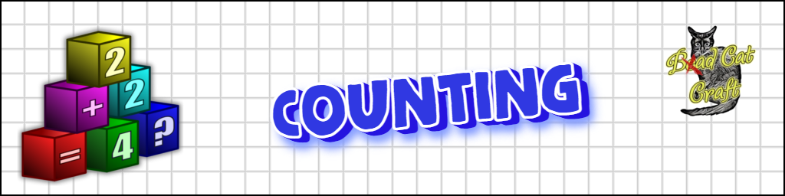

 
# Counting

_**Educational application for children, preparing for school**_
  
## Description:

  A developing and educational app for children and teenagers, as well as helping parents prepare their children for math school
- Voice dubbing (Text To Speech)
- 16 languages
- Adding numbers
- Subtracting digits
- Multiplication of digits
- Division of digits
- Logic tasks
- And much more

## Languages:
<table><tr>
  <td>    Беларускі </td>
  <td>    Български </td>
  <td>    Deutsch </td>
  <td>    English </td>
  <td>    Español </td>
  <td>    Eesti </td>
  <td>    Français </td>
  <td>    Italiano </td>
</tr>
<tr>
  <td>    Lietuviškas </td>
  <td>    Nederlandse </td>
  <td>    Polski </td>
  <td>    Português </td>
  <td>    Română </td>
  <td>    Русский </td>
  <td>    Türkçe </td>
  <td>    Українська </td>
</tr>
</table>

## Note

The project partially uses original and adapted images from an open project: <a href="https://openmoji.org"> OpenMoji </a>

----
